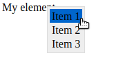

# Simple Javascript Menu

A JavaScript library to create a context menus for your web pages.

<div align="center">


</div>

## Install

Download the library file [context_menu.umd.cjs](https://code.germanov.dev/context_menu/context_menu.umd.cjs) and include it to your web page:

```html
<script src="context_menu.umd.cjs"></script>
```

or, if you develop project with JavaScript framework, you can install it using NPM:

```
npm install simple_js_menu
```

and import to your JavaScript code:

```javascript
import {Menus} from "simple_js_menu";
```

## Use

After install the library using one of two way above, you have `Menus` factory object in global namespace, which can be used to construct and setup menus.

Please see the basic example of how to construct and setup the menu:

```html
<html>
<head>
    <title>Context Menu Demo</title>
    <script src="https://code.germanov.dev/context_menu/context_menu.umd.cjs"></script>
</head>
<body>
<div id="myDiv">My element</div>

<script>
    // obtain a link to the element 
    const div = document.getElementById("myDiv");
    
    // define menu items
    const items = [
        {id:"item1", title: "Item 1"},
        {id:"item2", title: "Item 2"},
        {id:"item3", title: "Item 3"}
    ];
    
    // create menu with specified items
    // and bind it to specified DIV element
    const menu = Menus.create(items,div);

    // react when user clicks on menu items
    menu.on('click', (event) => {
        // run different actions depending on ID of item
        // on which user has clicked
        switch (event.itemId) {
            case "item1":
                console.log("User clicked first item");
                console.log("Mouse cursor position X:",
                        event.cursorX,"Y:",event.cursorY);
                break;
            case "item2":
                console.log("User clicked second item");
                console.log("Mouse cursor position X:",
                        event.cursorX,"Y:",event.cursorY);
                break;
            case "item3":
                console.log("User clicked third item");
                console.log("Mouse cursor position X:",
                        event.cursorX,"Y:",event.cursorY);
                break;
        }
    })
</script>
</body>
</html>
```

This page will display a DIV with `My Element` text. When you right-click on it, it will display a simple menu:

<div align="center">



</div>

When you click on any item, the `menu.on` method will react to your click and display appropriate text in JavaScript console.

## Documentation and examples

Read more advanced tutorial here: 

https://dev.to/andreygermanov/simple-way-to-add-custom-context-menus-to-web-pages-10lc

Full API documentation for `Menu` object you can find here:

https://github.com/AndreyGermanov/context_menu/blob/main/docs/API.md

Please, try the **SmartShape Studio** which uses context menus, created by this library to edit vector shapes:

https://shapes.germanov.dev


